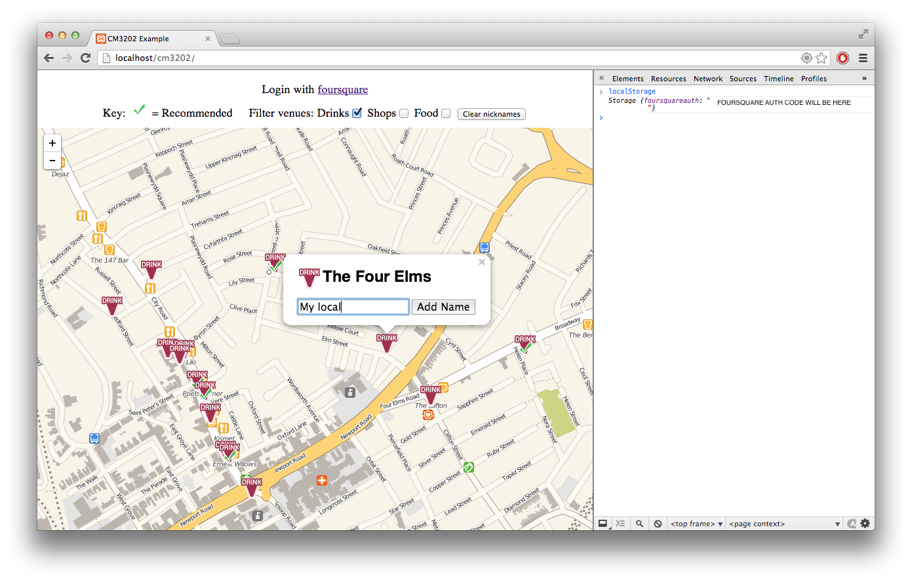

# Foursquare API application for CM3202

This coursework looked at developing an application using APIs from Foursquare and Cloudmade. The Foursquare API is queried for venues and the Cloudmade API is used to return map tiles.

The application is map-based and allows a user to view venues located in the search window. The user can choose to search for multiple venue types and assign alternative names to each of the venues. The alternative venue names are stored locally in the localStorage of a browser (as these names may be personal to a user).

Leaflet and jQuery libraries were also used in this application.

This coursework was delivered in March 2014 and received full marks.

